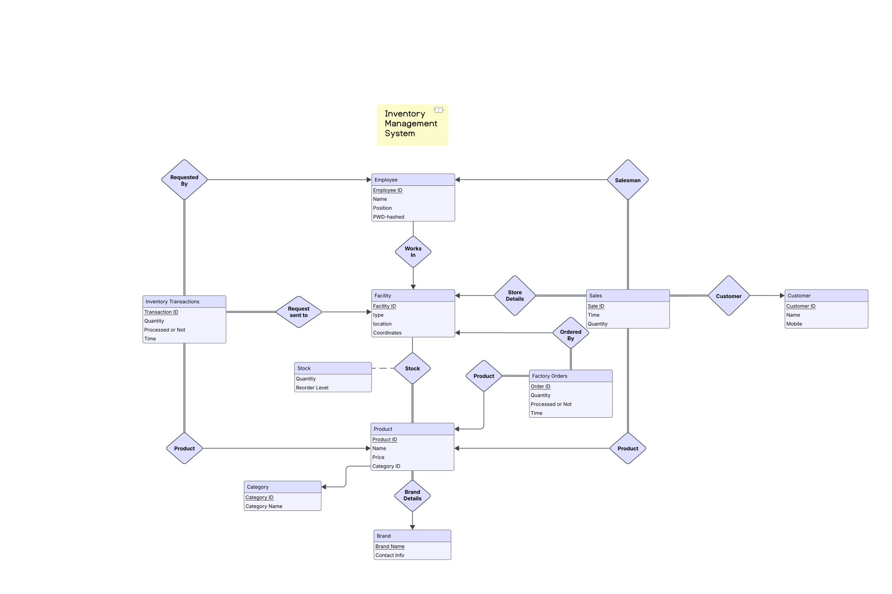

# Inventory Management System

An end-to-end Inventory Management System for a multi-facility company, designed using **MySQL** for the backend, **ReactJS** for the frontend, and **NodeJS** as the server-side runtime. The system handles stock tracking, factory orders, inventory transfers, sales, and analytics across stores and warehouses.

---

## 🏗️ Project Structure

### 📚 Database Design

The database includes the following relations:

- `facility`: Stores info about stores and warehouses.
- `employee`: Details of employees (including admin).
- `brand`: Info about footwear brands.
- `category`: Footwear category mapping.
- `product`: Details of each product.
- `stock`: Tracks product quantities per facility.
- `inventory_transactions`: Tracks warehouse-store transfers.
- `factory_orders`: Orders sent to the factory.
- `customer`: Store customer records.
- `sales`: Sales data.
- `alerts`: Auto-alerts for low stock.

### 🧠 Functional Dependencies

All relations are in **3NF**, ensuring minimal redundancy and improved integrity.

### 🛡️ Constraints

Key constraints for data integrity:

- Enforces positive values on price, quantity, reorder levels.
- Ensures logical transaction and stock operations.

### 🔄 Triggers

- `stock_alert_trigger`: Auto-generates restock alerts.
- `update_stock_after_transaction`: Updates stock on transaction completion.
- `update_stock_after_order`: Updates stock after factory delivery.

### ⚙️ Stored Procedures

- `apply_sale`: Handles sale transactions.
- `RequestInventoryTransaction`: Creates warehouse-store requests.
- `MarkTransactionAsCompleted`: Marks transactions as done.
- `AcceptFactoryOrder`: Finalizes factory orders.

### 🧮 Indexes

- **Time-Based**: For fast range queries.
- **Hash-Based**: For quick equality lookups on key attributes.

---

## 🖥️ User Interface

- **Frontend**: ReactJS (using `shadcn` for visual components).
- **Backend**: NodeJS (with `bcrypt` for password hashing).
- **Database**: MySQL

---

## 🧰 Key Functionalities

### 🔐 Admin

- Full access to view/update employees, products, facilities, brands.
- Analytical dashboard for sales & performance monitoring.

### 🧾 Store Employee

- Can view store-level stock & customer data.
- Can perform sales via a provided sale form.

### 🏬 Store Manager

- Can view/manage local stock, employees, customers, and transaction status.
- Can initiate inventory transactions with status flow:
  - `Sent` → `Accepted` → `Completed`

### 🏭 Warehouse Manager

- Can view/manage warehouse stock, employees, and transaction status.
- Can mark inventory transactions as Accepted.
- Can view factory orders and their statuses.
- Can initiate factory orders with status flow:
  - `Sent` → `Completed`

---

## 📈 ER Diagram



ER Diagram is available [here](https://lucid.app/lucidchart/94821bcf-9074-4075-ba55-4984eb365249/edit?viewport_loc=-1792%2C-2364%2C6652%2C3180%2C0_0&invitationId=inv_f05dc062-b1c6-4738-9a3f-078817437ed5).

---

## 📌 How to Run the Project

1. **Clone the repo**

   ```bash
   git clone <your-repo-url>
   cd inventory-management-system
   ```

2. **Install Dependencies**

   ```bash
   cd backend
   npm install
   cd ../frontend
   npm install
   ```

3. **Start Backend Server**

   ```bash
   cd backend
   npm run start
   ```

4. **Start Frontend Server**

   ```bash
   cd frontend
   npm run dev
   ```

5. **Ensure MySQL is running** and the database is initialized using provided schema files.

---
